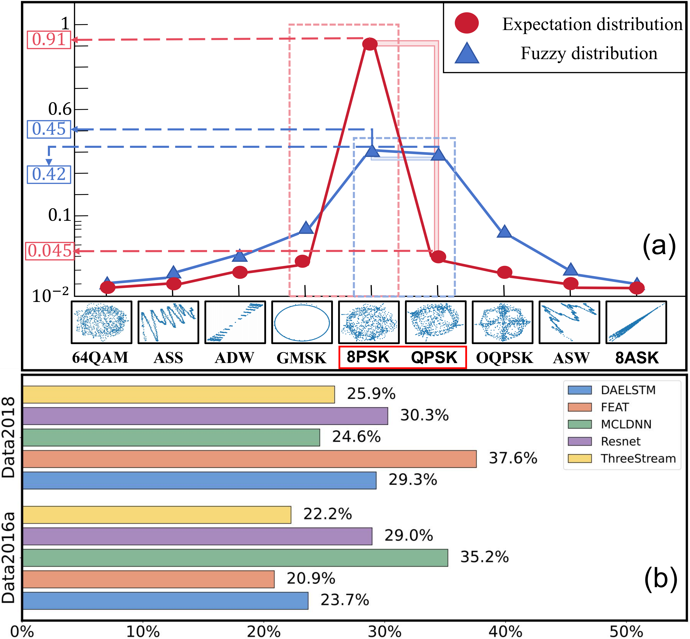

<h1 align="center">
  <a href="https://openreview.net/pdf?id=DDIGCk25BO" target="_blank">
    Robust Automatic Modulation Classification with Fuzzy Regularizationq
  </a>
</h1>

<p align="center">
  <a href="https://xinyanliang.github.io/">Xinyan Liang</a><sup>1</sup>, 
  Ruijie Sang<sup>1</sup>, 
  <a href="https://dig.sxu.edu.cn/qyh/">Yuhua Qian</a><sup>1</sup>, 
  Qian Guo<sup>2</sup>, 
  Feijiang Li<sup>1</sup>,
  Liang Du<sup>1</sup>
</p>

<p align="center">
  <sup>1</sup>Shanxi University, <sup>2</sup>Taiyuan University of Science and Technology
</p>

<p align="center">
  <a href="https://openreview.net/pdf?id=DDIGCk25BO">
    
  </a>
   &nbsp;&nbsp;&nbsp;&nbsp;
  <a href="https://www.deepsig.ai/">
    
  </a>
</p>

# Abstract
Automatic modulation classification (AMC) serves as a foundational pillar for cognitive radio systems, enabling critical functionalities including dynamic spectrum allocation, non-cooperative signal surveillance, and adaptive waveform optimization. However, practical deployment of
AMC faces a fundamental challenge: prediction ambiguity arising from intrinsic similarity among
modulation schemes and exacerbated under low signal-to-noise ratio (SNR) conditions. This phenomenon manifests as near-identical probability
distributions across confusable modulation types, significantly degrading classification reliability.
To address this, we propose Fuzzy Regularizationenhanced AMC (FR-AMC), a novel framework
that integrates uncertainty quantification into the
classification pipeline. The proposed FR has three
features: (1) Explicitly model prediction ambiguity during backpropagation, (2) dynamic sample
reweighting through adaptive loss scaling, (3) encourage margin maximization between confusable modulation clusters. Experimental results
on benchmark datasets demonstrate that the FR
achieves superior classification accuracy and robustness compared to compared methods, making
it a promising solution for real-world spectrum
management and communication applications.

<p align="center" style="margin-top:20px; margin-bottom:20px;">
  
</p>

# 🧱 Architecture
``` 
home/
├── amr/
│   ├── dataloaders/
│   ├── models/
│   │   ├── losses/
│   │   ├── networks/
│   ├── utils/
│   │   ├── __init__.py
│   │   ├── config.py
│   │   ├── draw.py
│   │   ├── init.py
│   │   ├── log_train_info.py
│   │   ├── logger.py
│   │   ├── solver.py
│   │   ├── static.py
├── Data/
├── train_DAELSTM/
│   ├── DAELSTM_configs/
│   ├── results/
│   ├── DAELSTM_configs.py
│   ├── train.py
│   ├── train_Cen.py
├── train_FEAT/
├── train_MCLDNN/
├── train_ThreeStream/
```

# 🛠️ Previous Preparation
## 1. Clone this repository and navigate to source folder
``` bash
cd AMCFR
``` 

## 2. Build environment

``` bash
echo "Creating conda environment"
conda env create -f environment.yml

echo "Activate the environment"
conda activate AMCFR
``` 

## 3. Download the dataset

All of our datasets are public datasets, and you can obtain the [datasets](https://www.deepsig.ai/) you need at this location. 
Download the dataset to the `./home/Data/` folder.

# 🚀 Quick Start
## 1. Modify the dataset address

Navigate to the`./home/amr/dataloaders/` directory and select the corresponding dataset loader file (e.g., `dataloader_2016aData.py`).
Locate the `data_path` variable and update its value to the path where your dataset is stored on your local machine.
```
class SignalDataLoader(object):
    def __init__(self, mod_type=[],snr_type=[],scal=0):
        mods = ['8PSK', 'AM-DSB', 'AM-SSB', 'BPSK', 'CPFSK', 'GFSK', 'PAM4', 'QAM16','QAM64', 'QPSK', 'WBFM']
        
        data_path=r'/home/Data/RML2016.10a_dict.pkl'
       
        data = pickle.load(open(data_path, 'rb'), encoding='iso-8859-1')
        data_keys=data.keys()
```

## 2. Model configuration

Choose the model you wish to train — for example, the `DAELSTM` model.  
Navigate to the corresponding configuration directory: `./home/train_DAELSEM/DAELSTM_configs/`.

This folder contains two YAML configuration files used for different training scripts:

- `DAELSTM_train.yaml` → used with `train.py`  
- `DAELSTM_train_Cen.yaml` → used with `train_Cen.py`

> **Note:** We provide two separate training scripts because the FR loss involves additional hyperparameters, while the other loss components do not require parameter tuning.

### (1) Modify the `DAELSTM_config.py` File
In the `DAELSTM_config.py` file, replace the path to the `DAELSTM_train.yaml` configuration file with its actual location on your local device.

```
def get_cfgs():
    cfgs = get_cfg_defaults()
    parser = argparse.ArgumentParser(description='AMR HyperParameters')
    parser.add_argument('--config', type=str, default='/home/train_DAELSTM/DAELSTM_configs/DAELSTM_train.yaml',
                        help='type of config file. e.g. resnet_cfo (Resnet_configs/resnet_cfo.yaml)')
    args = parser.parse_args()
    cfgs.merge_from_file(args.config)
    return cfgs
```

### (2) Modify the `DAELSTM_train.yaml` File
Within this file, the following keys define key components of the training process:

- `methon`: Specifies the path to the model architecture. For example:`"./home/amr/models/networks/DAELSTM"`.

- `network`: Indicates the specific network implementation to use, such as:`"DAELSTM.py"` or `"DAELSTM_1024.py"`.

- `train`: Determines whether to run the script in training mode or testing-only mode.

- `scal`: Control the noise intensity of the data.  

```yaml
method: 'DAELSTM'
train: True
dataset: '2016aData'
mod_type: ['8PSK', 'AM-DSB', 'AM-SSB', 'BPSK', 'CPFSK', 'GFSK', 'PAM4', 'QAM16','QAM64', 'QPSK', 'WBFM']
snr_type: [0,2,4,6,8,10,12,14,16,18]
scal : 0    #0,0.2,0.4,0.6
workers: 8
seed: 1
gpu: 7
cpu: False
params:
    "network": "DAELSTM"
    "loss": "loss_FG"
    "loss_c": 2
    "loss_t": 2
    "loss_alp": 0.01
    "batch_size": 128
    "epochs": 200
    "lr": 5e-3
    "lr_decay": 0.
    "weight_decay": 0.
    "early_stop": False
    "Xmode": [{"type":"AP","options":{"IQ_norm":False, "zero_mask":True}}]
```
### (3) Notes on `train.py` File
If you are working on a *k*-class classification task, the value of `c` should be set to the range `[1, k]`. The parameter `t` denotes the weight between the FR loss and the cross-entropy loss. 
For more details about parameter definitions and training settings, please refer to Section 4.6 of the [paper](https://openreview.net/pdf?id=DDIGCk25BO).

```
if __name__ == '__main__':
    c = [5]
    t = [ 0.0001 ]
    best_acc=0
    for c1 in c:
        for t1 in t:
            cfgs = get_cfgs()
            main(cfgs,c1,t1)
```

## 3. Train
### Running Loss Functions with hyperparameter
```bash
cd './home/train_DAELSTM'
python train.py
```
### Running Loss Functions Without hyperparameter
```bash
cd './home/train_DAELSTM'
python train_Cen.py
```
## 4. Checking the results
Upon completion of the training process, the program will automatically create a `./results/` directory.

This folder stores:

- The best model parameters based on validation performance(`./checkpoints/`)  
- Training information and logs(`train_info.csv` and `test_info.csv`)  
- The confusion matrix for classification evaluation(`./draws/`)
```
├── train_DAELSTM/
│   ├── DAELSTM_configs/
│   ├── results/
│   │   ├── DAELSTM/
│   │   │   ├── DatasetName/
│   │   │   │   ├── lossName/
│   │   │   │   │   ├── paramers/
│   │   │   │   │   │   ├── checkpoints/
│   │   │   │   │   │   ├── draws/
│   │   │   │   │   │   ├── train_info.csv
│   │   │   │   │   ├── test_info.csv
```
# 🔄 Select other models or datasets
## Change the dataset
To use a new dataset with this framework, follow the steps below:

1. **Download the dataset**  
 Download the dataset to the specified directory `./home/Data/`.

2. **Create a new data loader**  
   In the `./home/amr/dataloaders/` folder, create a new data loader script named: `dataloader_Newdataset.py`. Ensure that the output format and return values are consistent with existing loaders (e.g., `dataloader_2016aData.py`).

3. **Update the configuration file**  
   Modify the relevant config file to use your new dataset. For example, in: `./home/train_DAELSTM/DAELSTM_configs/DAELSTM_train.yaml` set the `dataset` field to:`dataset: Newdataset`.

## Change the model
To add and train a new model within this framework, follow these steps:

1. **Save the model implementation**  
   Place your model definition file in the following directory: `./home/amr/models/networks/`.

2. **Create a new training folder**  
   Create a subdirectory named `train_Newmodel`, following the structure of the existing `train_DAELSTM` folder.  
   This folder should contain configuration and training scripts specific to the new model.

3. **Configure the model and training parameters**  
   Create new configuration and training script files (`Newmodel_config.py`, `Newmodel_train.yaml` and `train.py`) based on the existing ones (e.g., `DAELSTM_config.py`, `DAELSTM_train.yaml` and `train.py`).
   
# 📝 Citation
Please consider citing our paper if our code and benchmark are useful:
```
@inproceedings{
liang2025robust,
title={Robust Automatic Modulation Classification with Fuzzy Regularization},
author={Xinyan Liang and Ruijie Sang and Yuhua Qian and Qian Guo and Feijiang Li and Liang Du},
booktitle={Forty-second International Conference on Machine Learning},
year={2025},
url={https://openreview.net/forum?id=DDIGCk25BO}
}
```
# 🙏 Acknowledgement
Our AMCFR is developed based on the codebases of [TransGroupNet](https://github.com/DTMB-DL/TransGroupNet), and we gratefully acknowledge the developer's contribution.
# 📪 Contact
For any question, feel free to email `sangrj66@163.com`.


